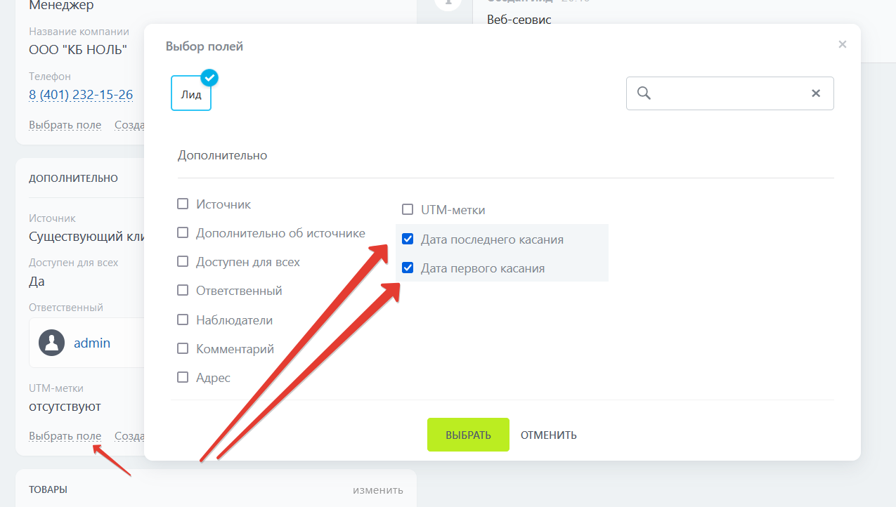

# Модуль для битрикс 24

Модуль фиксирует время касания (звонок, сообщение, дело) с лидом и сделкой, фиксируется время сервера. 

# Установка. 
- Модуль необходимо перенести на портал от корневого каталога сайта по следующему пути /local/modules/
- Модуль необходимо установить, как партнерский модуль в административном разделе http://{your_site}/bitrix/admin/partner_modules.php
- Вывести поля в карточке лида/сделки, если необходимо.    
